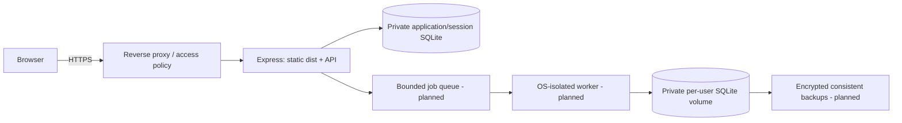

# Deployment and temporary preview

## Status

The local frontend build and Express serving path are implemented. A durable public deployment has **not** been provisioned. No domain, cloud service, tunnel, cost-bearing resource or third-party account was created. This release's [threat model](SECURITY.md) blocks public exposure until SQL workers have OS-enforced resource and filesystem isolation.

## A realistic deployment design

A small Linux VM with a persistent SSD, a reverse proxy such as Caddy/Nginx, one Express process and a separate restricted SQL worker service is a plausible first deployment. Use a private staging environment before allowing internet users. This is an architecture proposal, not a claim of a running hosted service.



1. Install Node 24 LTS and Git. Clone the repository and use `npm ci`, `npm run check`, `npm run build`. The build produces `dist/`; no Vite dev server should be public.
2. Provision a **fresh**, private data directory outside the web root, for example `/var/lib/sql-playground`. The app's OS user owns it; avoid world-readable permissions. Do not reuse the local demo DB in production. Store per-user DBs and app/session DB on persistent storage, not an ephemeral serverless filesystem.
3. Set server-side environment: `NODE_ENV=production`, `PORT=15000`, `DATA_DIR=/var/lib/sql-playground`, a cryptographically random `SESSION_SECRET` of at least 32 characters, and the real HTTPS `CLIENT_URL`. Optional Google callback and OpenAI settings belong in a secret manager or a restricted environment file. Never bundle them with Vite.
4. `npm start` serves `dist` and `/api` together on loopback. A process supervisor such as systemd restarts it. Reverse-proxy only that service, terminate HTTPS, forward trusted headers and keep exactly the configured trusted proxy hop. Secure cookies are enabled in production. Ensure the public Origin exactly matches CLIENT_URL.
5. Move query execution behind a separate worker identity with a mount containing only its assigned database. Apply hard native-memory, CPU, PID, temporary-storage and disk quotas. The current `fork()` boundary does not do this. A malicious SQL expression can allocate native memory faster than a JavaScript timer can help.
6. Restrict account creation/invite access and add account lifecycle policies. Use fresh accounts, never the public demo password. Add structured redacted request IDs, error counts, worker exits, queue/latency metrics and disk usage alerts. Do not log passwords, session cookies, API keys or raw learner SQL by default.
7. Probe `/api/health` and add an operational readiness check that tests writable storage/worker capacity. The current health route is a liveness response only. Monitor 4xx/5xx, SQLITE_BUSY/FULL, deadline kills and provider fallback rate.
8. For a consistent backup, stop writes briefly or use SQLite's supported backup API. Do not blindly copy a live WAL database without its consistent state. Encrypt backups, retain multiple versions, restrict access, and periodically restore into an isolated environment. Current reset backups are a demo convenience, not a production backup scheduler.

## Operational limits

One SQLite writer per file, a central application DB and single-process request throttles limit horizontal scale. A second API instance must share session state and coordinate workspace ownership and job limits. NFS-style shared filesystem access is not an automatic safe SQLite deployment design. For substantial scale, consider a central service database for accounts/scores plus dedicated sandbox workers, while keeping practice DBs isolated. Evaluate total storage and cleanup policy before unbounded registration.

CI runs backend tests and the frontend build on Windows and Linux with Node 24. Passing CI is necessary but does not prove public-sandbox security. See the actual Actions run before claiming CI success; local verification and remote CI status are recorded separately.

## Temporary Cloudflare Quick Tunnel

A Quick Tunnel is short-lived development access with a generated hostname. It is not durable hosting. Cloudflare documents a 200 in-flight request limit and no SSE support for Quick Tunnels: [official Quick Tunnel guide](https://developers.cloudflare.com/cloudflare-one/networks/connectors/cloudflare-tunnel/do-more-with-tunnels/trycloudflare/).

Run the checked local preflight now:

```powershell
cd "C:\Users\sahil\OneDrive\Documents\Projects\SQL-Playground"
npm run preview:check
```

It deliberately exits nonzero and reports the exact blockers: no hard OS native-memory/CPU quotas, no OS filesystem sandbox, and a development-account/HTTPS policy unsuitable for public access. **No tunnel was launched.** `cloudflared` was not installed on this laptop, so the tunnel command itself is documented from the vendor, not falsely reported as tested end-to-end.

After those blockers have actually been resolved, use the production-built Express endpoint, not Vite or a directory server. The vendor command shape for this laptop's API port is:

```powershell
cloudflared tunnel --url http://127.0.0.1:15000
```

Set CLIENT_URL to the generated HTTPS origin and restart the production app before login; set Google callback to that same HTTPS origin plus `/api/auth/google/callback` if testing OAuth, and update the Google authorized redirect URI. A new Quick Tunnel hostname invalidates that setup. Run the same authentication, isolation, Origin and cookie acceptance checks through the public origin before sharing it. Stop cloudflared with Ctrl+C.

Never expose a home directory, `.pats`, repository root, `server/data`, debug/controller endpoints, or Vite filesystem access. The app serves only `dist` in production, but that alone does not solve the SQL-worker boundary. A named access-controlled tunnel or private screen-sharing demonstration is a more appropriate next step than advertising the present development server publicly.
