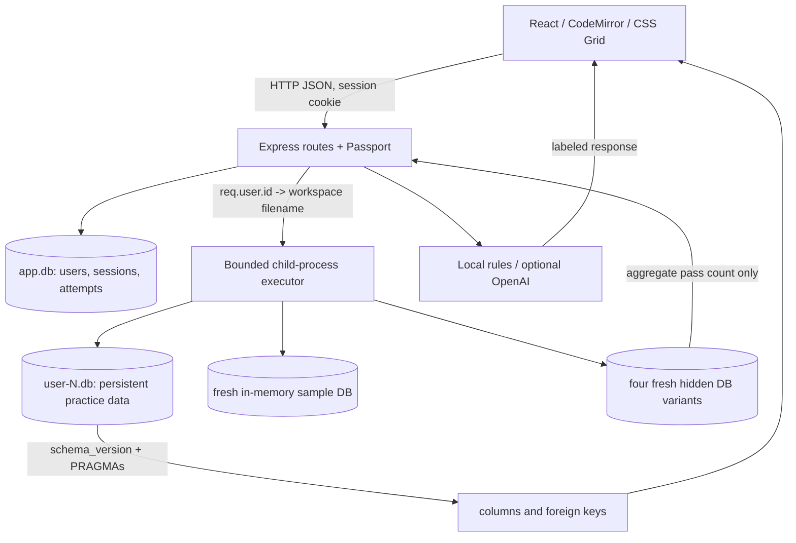

# Interview guide: SQL Playground

Prepared for the 26 September 2026 Digital Engineering interview (Asia/Kolkata). Read this with the code open. The supplied JD is the basis for the topic selection; no claims are made about Tredence's actual interview questions or process. The resume was used as a feature contract, not as proof that the rebuilt code existed previously. No personal contact details from either source are included.

## A truthful 60-second explanation

“SQL Playground is a browser-based SQL practice platform. React presents four panes: a schema browser, an ER diagram, a SQL editor and results. Express authenticates users with Passport and resolves each user's persistent SQLite file using the server-side user ID. SQL runs in a separate process, so a slow query can be stopped without blocking the web server. Practice mode allows changes to the user's database. Interview mode runs a single read-only solution on controlled datasets, checks four server-held hidden variants, and calculates a score using server timestamps. The SQL Coach works offline using labeled local rules, with an optional server-side OpenAI path. I rebuilt this version with Codex assistance on 25 September, preserved the older repository history, and verified it using automated tests and a browser walkthrough. Successful live Google and valid-key OpenAI flows still need credentials-based testing.”

Do not say you wrote all of it unaided. Say what you reviewed, tested, and can explain now. If you cannot explain a file yet, spend your preparation time there rather than memorizing a claim.

## Five-minute live demonstration

| Time      | Click / action                                                   | What to explain                                                                          |
| --------- | ---------------------------------------------------------------- | ---------------------------------------------------------------------------------------- |
| 0:00–0:40 | Open `http://localhost:15173`; Explore the local demo            | No external credentials or database service required; sample data already exists         |
| 0:40–1:20 | Point to all four panes; Run query                               | A real JOIN executes in SQLite; result columns/rows arrive as JSON                       |
| 1:20–2:10 | Sample SQL -> Create + insert + select -> Run query              | Three statements; `Hello; SQL!` remains one string; notes table/FK refresh automatically |
| 2:10–2:45 | SQL Coach -> Ask Coach                                           | Local Coach is deterministic; discuss `SELECT *` hint; no LLM claim                      |
| 2:45–3:10 | Close Coach; Interview -> Above the threshold -> Start challenge | Sample data is isolated from practice; server has the deadline; Coach disabled           |
| 3:10–4:05 | Enter the query below; Run sample; Submit solution               | Run sees public examples; submit sees four fresh hidden datasets; explain score          |
| 4:05–4:35 | All challenges; show solved state and best score                 | Attempts and scores persist in the application database                                  |
| 4:35–5:00 | Practice -> Reset workspace -> confirm                           | Only own practice data is reset; mention public-hosting limits honestly                  |

```sql
SELECT id, name, salary
FROM employees
WHERE salary > 50000
ORDER BY id;
```

Extended proof if asked: create a table, log out/in and show it persists; register a synthetic second account and show the table is absent. These were exercised in the rebuild's browser acceptance walkthrough. Do not use your personal email during the interview demo.

## Architecture and data flow



**Practice request:** Editor state -> `api('/sql/execute', {sql})` -> authenticated route -> `workspacePath(req.user.id)` -> child process -> lexer/policy/SQLite -> result arrays -> Results component. Schema version changes trigger a metadata reload. That metadata drives both the explorer and ER diagram.

**Interview submission:** fetch owned active attempt -> check server deadline -> atomically mark grading -> run on four hidden variants -> compare shape/rows -> derive score from server receipt time -> persist -> return aggregate status. Grading exceptions never include hidden rows.

## Twelve files to know

| File                                | Purpose / why it exists                                                | Likely question                                                          |
| ----------------------------------- | ---------------------------------------------------------------------- | ------------------------------------------------------------------------ |
| `client/src/main.jsx`               | Routes, auth state, practice/interview pages; ties components together | How does changing mode change state and API behavior?                    |
| `client/src/components/Editor.jsx`  | CodeMirror lifecycle, SQL highlighting and Ctrl+Enter                  | Why use refs and effect cleanup around a non-React editor?               |
| `client/src/components/Schema.jsx`  | Explorer and SVG relationships from one metadata response              | How does a FOREIGN KEY become a relationship line?                       |
| `client/src/components/Results.jsx` | Per-statement tables, affected rows, errors, truncation                | Why are rows arrays instead of objects?                                  |
| `server/src/app.js`                 | Middleware ordering, session/CORS/Origin policy, API boundaries        | Why must auth run before SQL routes?                                     |
| `server/src/auth.js`                | Passport local/Google strategies and bcrypt                            | What is stored in the browser cookie?                                    |
| `server/src/database.js`            | Application schema, persistent session store, workspace paths          | Why is the application DB separate from workspace DBs?                   |
| `server/src/sql.js`                 | Lexer, safe command subset, execution and introspection                | Why can't you split SQL on every semicolon?                              |
| `server/src/executor.js`            | Concurrency caps and killable child deadlines                          | Why doesn't setTimeout interrupt synchronous SQLite in the same process? |
| `server/src/query-worker.js`        | Actual SQLite execution and fresh grading databases                    | What state survives between queries?                                     |
| `server/src/interview.js`           | Attempt lifecycle, ownership, deadline, scoring                        | How do you prevent score tampering or duplicate submits?                 |
| `server/src/coach.js`               | Local rules and optional bounded provider request                      | What happens when the API key is invalid?                                |

Also inspect `challenges.js`, `seeds.js`, `server/test/`, and `scripts/demo.js`. Full route and table reference: [API.md](API.md).

## Design decisions and tradeoffs

- **SQLite:** no database service, one file per learner, excellent local portability. Per-file write concurrency and file operations complicate multi-host scaling.
- **better-sqlite3:** clear synchronous prepare/run/iterate API. Put it in a child process because synchronous CPU-heavy work would block Express otherwise. Starting a process per job costs latency but simplifies cancellation and state cleanup.
- **Session auth:** Passport serializers store an ID server-side in SQLite sessions. It is simple to invalidate on logout; scaling requires shared session storage or consistent routing.
- **Multi-statement semantics:** sequential autocommit is easy to demonstrate; the batch is not atomic. Explicit transactions/triggers are restricted to keep bounded jobs and parsing honest.
- **Grading:** multiple datasets catch many hardcoded/wrong queries, but cannot prove mathematical equivalence for every possible database. Public source code is not secret from a motivated learner.
- **ER diagram:** ordinary metadata plus SVG is enough for a small student project. It scrolls; it is not a full graph-layout editor and does not infer joins without declared foreign keys.
- **Coach:** offline rules make the demo reliable and explainable. Provider output is optional and fallible. No claim that the local rules understand arbitrary English.
- **Cloud:** the Express production entry and frontend build exist; public deployment requires stronger OS isolation and operational work. See [DEPLOYMENT.md](DEPLOYMENT.md).

## Debugging stories you can truthfully discuss

These are observed rebuild events, not invented earlier personal experiences. [REBUILD.md](REBUILD.md) has the details.

1. **Native module ABI:** two Node runtimes meant a SQLite binary compiled/downloaded for Node 20 failed under Node 24. Checking the reported ABI and making install/runtime consistent fixed the mismatch. A compatible prebuilt package avoided requiring Visual Studio C++ tools.
2. **Reserved ports:** neither port had a listening process. The socket error was EACCES, not EADDRINUSE. Checking Windows' excluded ranges revealed the cause, leading to a transparent fallback rather than killing unrelated processes.
3. **Result isolation:** a demo account created notes; a second account received “no such table.” The server-derived filename, not a client user ID, made the boundary enforceable.
4. **Failure handling:** an infinite recursive aggregate hit the child deadline. The next query succeeded. This validated process isolation and cleanup rather than merely checking a happy-path SELECT.
5. **Reviewing generated UI:** the initial completed timer and schema label were misleading. They were corrected after inspecting real browser output. This illustrates why a generated UI needs semantic review, not just a successful build.
6. **Keyboard shortcut precedence:** Ctrl+Enter initially inserted a newline because CodeMirror's default keymap came first. Moving the Run binding before basicSetup fixed it, and a browser-triggered SELECT returned 42. This is a concrete UI issue that the backend tests could not catch.

## Technical questions and natural answers

### Project and backend fundamentals

1. **Why React?** It keeps the editor, result status, active mode and schema views synchronized through state. Reusable components keep the four panes separate.
2. **Why Express?** It provides a small HTTP routing and middleware layer. It lets authentication, validation and JSON error handling run before business logic.
3. **Why SQLite instead of PostgreSQL here?** This demo needs no database server, and a file per learner gives a simple workspace boundary. PostgreSQL is often better for a shared high-concurrency service, but is not required for this local use case.
4. **Why better-sqlite3?** Its prepared-statement API is straightforward. Because it is synchronous, I isolate query work in a child process instead of running arbitrary queries on Express's event loop.
5. **What does Passport do?** Strategies verify credentials. Passport serializes the user's ID into the session and deserializes it on future requests, giving routes `req.user`.
6. **What does express-session do?** It manages the session cookie and store. The browser receives a signed opaque ID, while session data is persisted in the application SQLite database.
7. **How are passwords stored?** As bcrypt hashes with cost 12, not plaintext. bcrypt provides a salt and expensive verification; it is hashing, not reversible encryption.
8. **How is user isolation enforced?** The authenticated numeric ID creates a filename such as `user-1.db`. A request cannot supply an alternative user ID or database path. ATTACH and file-access operations are blocked.
9. **Why separate app.db?** User SQL must not modify passwords, sessions or scores. Those tables are on another connection and file that the SQL route never opens.
10. **Why not split on semicolons?** Semicolons can be inside quoted strings or comments. A lexer tracks those states; SQLite then parses each resulting statement. Trigger bodies and explicit transactions are unsupported and rejected.
11. **What happens if statement two fails?** Statement one remains committed. Statement two returns an error and statement three is skipped. The response identifies the failing statement and its starting line.
12. **How do SELECT and INSERT differ?** Prepared statements with `reader` produce columns and rows. Non-readers use `run()` and report changes. `RETURNING` can make a write statement a reader.
13. **How does the live ER update work?** The server compares SQLite's schema_version before and after execution. If it changes, React reloads table/column/foreign-key metadata and redraws both schema views.
14. **What is a primary key versus a foreign key?** A primary key identifies a row. A foreign key references a parent key and, when enforced, prevents references to missing parent rows.
15. **What is an index tradeoff?** It can make selective lookups or joins faster but uses storage and adds work to writes. I would inspect EXPLAIN QUERY PLAN and measure rather than assuming every index helps.
16. **INNER JOIN versus LEFT JOIN?** INNER JOIN returns matching pairs. LEFT JOIN retains all rows from the left table, with NULL right-side values when no match exists.
17. **COUNT(\*) versus COUNT(e.id)?** COUNT(*) counts joined rows, including the placeholder row from an unmatched LEFT JOIN. COUNT(e.id) ignores NULL, so empty departments correctly count as zero.
18. **WHERE versus HAVING?** WHERE filters rows before grouping; HAVING filters aggregate groups. “More than three employees per department” needs HAVING.
19. **What is a correlated subquery?** It refers to a column of the surrounding query. The department-average challenge uses the current employee's department when computing the average.
20. **ROW_NUMBER, RANK and DENSE_RANK?** ROW_NUMBER assigns different sequence numbers. RANK gives ties the same rank and leaves gaps. DENSE_RANK gives ties the same rank without gaps.
21. **How are hidden tests checked?** Each submission is run on four new controlled databases. A server-only reference query produces the expected rows. Only aggregate pass/fail and score are returned.
22. **How are results compared?** Column aliases and order must match. Unordered questions compare sorted serialized rows while keeping duplicates; ordered questions compare the row sequence directly.
23. **How can a timer be trusted?** The browser is only a display. The server stores start and deadline and checks receipt time. Changing a browser variable does not change the persisted deadline.
24. **What is the scoring formula?** Up to 80 points comes from the fraction of hidden datasets passed. Only an all-pass submission receives up to 20 extra points for remaining time. The server computes and stores it.
25. **How are repeat submissions handled?** The server atomically changes active to grading before awaiting the worker. The same attempt cannot be claimed twice. Restarting creates a separate attempt.
26. **Practice versus Interview?** Practice mutates a persistent personal DB without a score. Interview executes a read-only query on fresh controlled data, has a server deadline and tracked score, and disables Coach.
27. **Is Local Coach AI?** It is a labeled deterministic rules engine. It explains common clauses and errors, gives limited hints and two SQL templates. Optional model output is separately labeled AI Coach.
28. **What happens when the provider fails?** The server times out or handles the failure and returns Local Coach guidance. It never blocks ordinary SQL or scoring. Secrets and raw provider errors are not exposed.
29. **Does a child process make this safe for the public internet?** No. It gives a killable execution boundary but runs with the same OS authority. Native-memory, CPU and filesystem sandboxing need OS enforcement before public exposure.
30. **How would you scale it?** Separate the API and restricted execution workers, add a bounded job queue and OS quotas, and choose shared session/application storage. Workspace files need deliberate ownership/routing and backup design; a load balancer alone is not sufficient.

### Ten JD-aligned Digital Engineering questions

These connect directly to the supplied Tredence JD's foundations and responsibilities; they are preparation topics, not predictions.

31. **[HTTP/REST/JSON] Why POST to execute a query?** Execution can change data and the SQL belongs in a JSON body, not a URL. GET is used for metadata and health reads. Status codes distinguish authentication, validation and server failures.
32. **[Programming] Explain async versus synchronous work here.** HTTP/provider calls can await without blocking JavaScript execution. better-sqlite3 runs synchronously, so a parent timeout cannot interrupt it in the same event loop. A separate process lets the parent kill runaway work.
33. **[DSA] What is the complexity of the lexer and comparison?** Lexing is O(n) in SQL length, with output proportional to input. Unordered result sorting is O(r log r), plus row serialization cost. Results are bounded to keep that work small.
34. **[OOP] Where is encapsulation visible?** SQLiteSessionStore extends the session Store interface and hides SQL persistence behind get/set/destroy/touch methods. Other modules depend on that behavior without knowing the storage details. Most app logic is functional; I would not claim it is an OOP-heavy design.
35. **[HTML/CSS/React] How is UI state managed?** Components own editor text, loading/error states, schema and results with hooks. CSS Grid makes the desktop panes; Flexbox arranges toolbars. CodeMirror is created and destroyed in an effect, with refs avoiding stale callbacks.
36. **[Relational design] Why not join employees and projects then sum?** Both are one-to-many children of a department. Joining them together multiplies rows and can inflate counts/budgets. Aggregate each child independently or use correlated subqueries before combining totals.
37. **[Testing/debugging] How did you verify the app?** Backend integration tests use real SQLite and authenticated agents, cover two-user isolation and grading edge cases, and force resource failures. A browser walkthrough validates user-visible flows. A build alone would not prove persistence, hidden-test secrecy or scoring correctness.
38. **[Secure coding] Is this ordinary SQL injection?** The user's SQL is intentionally executed in a restricted personal sandbox. Parameterizing that whole query would disable the feature. Separately, account/session/attempt queries use bindings, and isolation plus command/resource controls protect the execution boundary.
39. **[Git/cloud] How would you collaborate and deploy?** Preserve history, work on a branch, use meaningful commits and a reviewed PR with CI. Build static frontend files, run Express behind HTTPS, keep SQLite files on private persistent storage and test backups. Public workers need stronger isolation before release.
40. **[AI-assisted development] How did you review generated code?** I distinguish generated implementation from verified behavior. Tests exercised negative cases, real browser actions exposed UI issues, and dependency/runtime checks caught a native ABI problem. I would explain the code myself, acknowledge AI help and leave untested credential paths labeled unverified.

## Last-hour preparation order

1. Rehearse the demo without reading this document.
2. Trace `req.user.id` from Passport to workspacePath and the worker.
3. Explain a JOIN, GROUP BY/HAVING, NULL behavior and dense ranking on paper.
4. Read the lexer, timer/score calculation and one isolation test.
5. State the public-hosting limit and credential verification status without exaggeration.
6. Review [CHEATSHEET.md](CHEATSHEET.md) and keep [README](../README.md) available for recovery.
